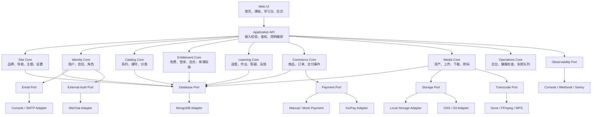
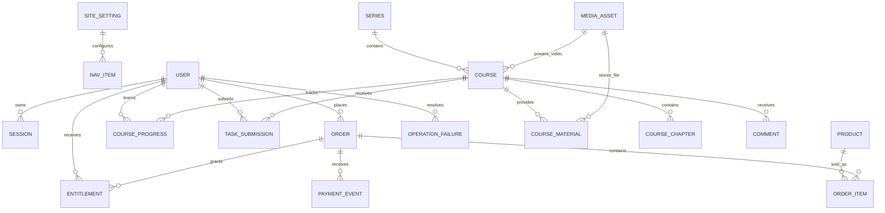
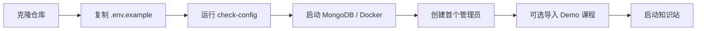
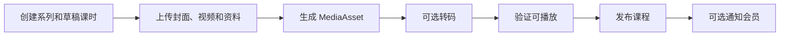
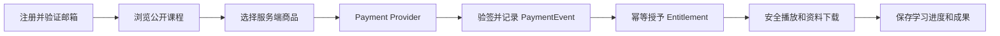
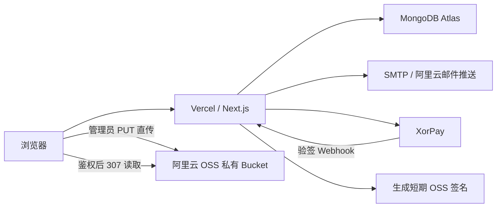

# 架构总览

## 1. 目标架构



核心约束：

> 领域模块决定业务规则，Provider 只负责外部服务调用；未配置某个 Provider 时，核心站点仍可降级运行。

## 2. 目标数据拓扑



关键变化：

- `Entitlement` 取代单一 `isVIP` 判断；
- `Product + OrderItem` 取代订单 JSON 中的商品信息；
- `PaymentEvent` 负责回调留痕和幂等处理；
- `MediaAsset` 统一视频、封面和课程资料；
- `OperationFailure` 聚合支付、转码、邮件与存储故障，不替代领域事实；
- 微信、飞书和 AI 网关信息不进入核心 `User`。

## 3. 三条关键业务流

### 创作者初始化



### 内容发布



### 购买与学习



## 4. 计划目录

```text
mdldm-knowledge-kit/
├── app/
├── components/
├── modules/
│   ├── site/
│   ├── identity/
│   ├── catalog/
│   ├── entitlement/
│   ├── commerce/
│   ├── media/
│   ├── learning/
│   └── operations/
├── providers/
│   ├── database/mongodb/
│   ├── storage/local/
│   ├── storage/oss/
│   ├── payment/manual/
│   ├── payment/xorpay/
│   ├── email/console/
│   ├── email/smtp/
│   ├── transcode/ffmpeg/
│   └── observability/webhook/
├── config/
├── models/
├── scripts/
├── public/demo/
└── docs/
```

第一阶段保持一个 Next.js 仓库，不提前拆成复杂 Monorepo。

## 5. 当前生产部署拓扑



- Vercel 负责页面、API、会话与权益编排，不持久保存媒体；
- Atlas 保存用户、Session、Token、限流、课程、权益和学习数据；
- OSS 保持私有，上传与读取都由短期签名授权；
- SMTP 只通过 Email Port 调用；
- XorPay 只负责支付协议，价格校验、PaymentEvent 和 Entitlement 仍在服务端领域流程；
- Preview 与 Production 必须使用隔离的数据和密钥。
