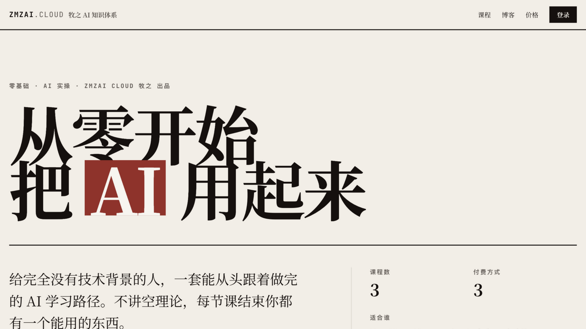

# Demo 内容与验证路径

`npm run seed-demo` 只生成虚构数据，不复制原站课程、用户、订单、评价或品牌素材。

## 内置内容

| 类型 | Demo |
| --- | --- |
| 系列 | 创作者知识产品入门 |
| 公开课 | 从一节公开课开始 |
| 会员课 | 会员内容交付流程 |
| 单课 | 单课购买与交付 |
| 视频 | ffmpeg 生成的 8 秒测试画面，无真人和第三方素材 |
| 资料 | 纯文本课程说明 |
| 商品 | 一年期全站会员、单课永久访问 |

Demo 管理员由部署者使用 `npm run create-admin` 创建，仓库不提供固定生产账号。README 和 CI 中的 `admin@example.com` 及测试密码只用于本地或隔离自动化环境，不能用于公网部署。

## 推荐验证顺序

1. 打开首页和 `/courses`，确认公开内容可见；
2. 打开“从一节公开课开始”，验证 MP4 Range 播放和资料下载；
3. 注册一个 `example.com` 测试用户，通过 Console Email 链接完成验证；
4. 在 `/pricing` 分别购买会员商品与单课商品；
5. 使用 Mock Payment 确认支付，检查订单和 Entitlement；
6. 验证会员课、单课和学习进度；
7. 使用管理员打开 `/admin`，检查课程、订单、运营指标与失败队列；
8. 访问 `/api/health?deep=1` 验证 MongoDB。

## 界面预览

### 首页

截图来自只含虚构数据的隔离 Demo 数据库。每次明显改变界面时，应重新生成并检查截图中不存在真实邮箱、订单、域名或密钥。
